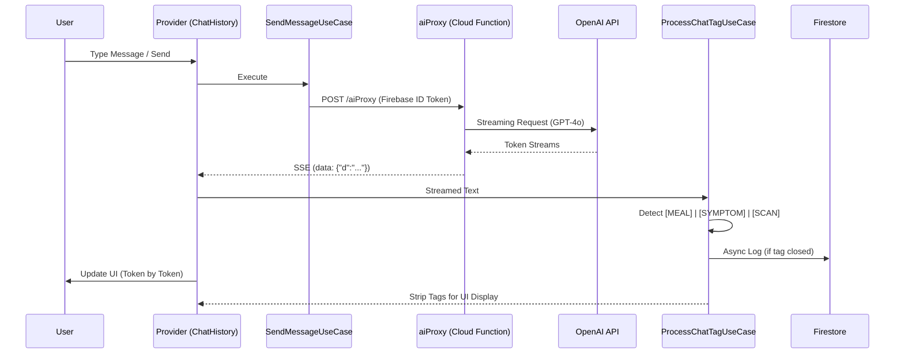
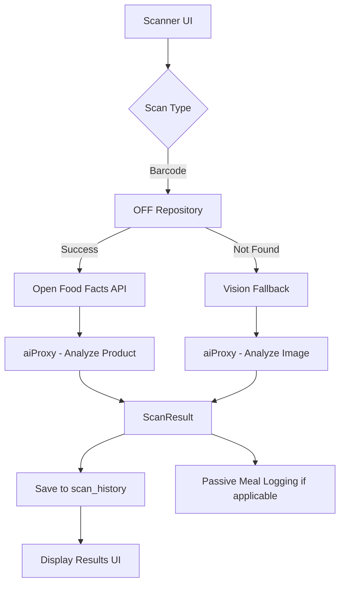
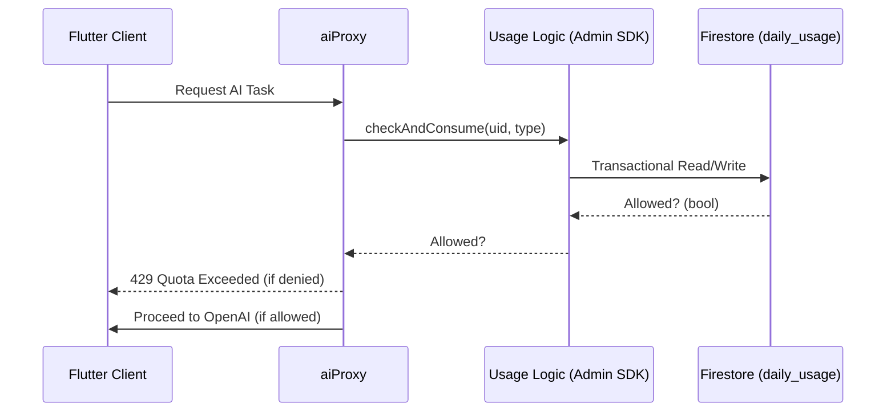

# GutGood — Architecture & Data Flow Overview

## 🏗️ High-Level Architecture

GutGood follows **Clean Architecture** (Feature-First) on the frontend and leverages a **Serverless Firebase Backend**.

### 📱 Frontend (Flutter)
- **Framework:** Flutter (Clean Architecture)
- **State Management:** `Provider` (ChangeNotifier) for presentation state.
- **Dependency Injection:** `GetIt` for service and repository orchestration.
- **Navigation:** `GoRouter` with `StatefulShellRoute` for a persistent bottom navigation shell.
- **Persistence:** Firestore Persistence (primary) + SQLite (referenced in docs, but Firestore's native cache is the active implementation).

### ☁️ Backend (Firebase)
- **Authentication:** Firebase Auth (Supports Anonymous, Google, Apple, and Email/Magic Link).
- **Database:** Cloud Firestore (Hierarchical: `user_profiles/{uid}/[sub-collections]`).
- **Storage:** Firebase Storage (User-uploaded images/photos).
- **Functions:** Firebase Cloud Functions (Node.js/TypeScript).
- **AI Gateway:** `aiProxy` (HTTPS Function) acts as the secure, authenticated bridge to OpenAI.

---

## 🔄 Core Data Flows

### 1. AI Chat Flow (Streaming & Passive Logging)
The chat system is the central intelligence hub, using "Passive Logging" to extract data from natural conversation.

### 2. Hybrid Scanner Flow
Combines deterministic barcode lookup with probabilistic AI vision analysis.

### 3. Usage Metering & Quotas
Enforces server-authoritative limits to prevent client-side bypassing.

## 🛡️ Security & Integrity Patterns

1. **Secret Management:** OpenAI keys are stored in **Cloud Secret Manager**, never exposed to the client or Remote Config.
2. **Identity-Bound Data:** Security rules ensure `request.auth.uid == userId` for all reads/writes.
3. **Atomic Merging:** A dedicated Cloud Function (`mergeAnonymousAccount`) uses Admin SDK to atomically move data when a guest upgrades to a permanent account, preventing data fragmentation.
4. **Idempotency:** Cloud Functions use `idempotencyKey` from the client to prevent duplicate operations (e.g., double streaks or duplicate chat messages) during network retries.
