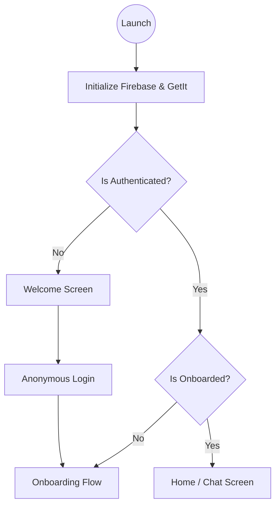
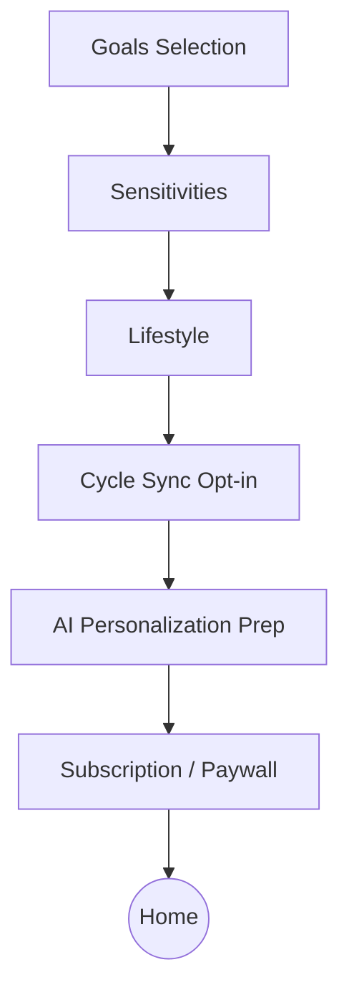
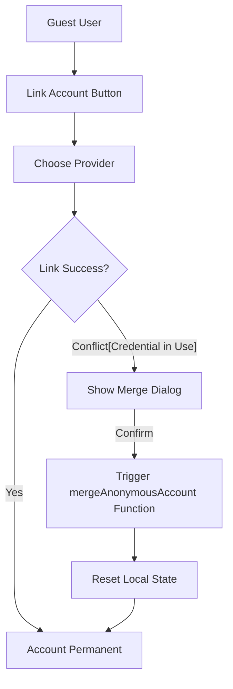
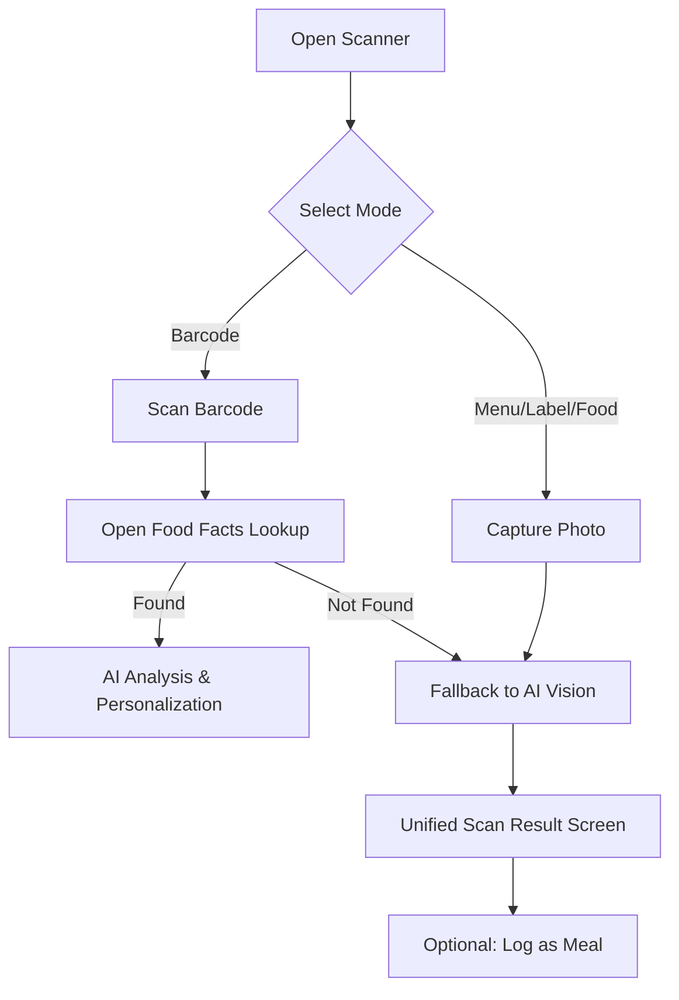
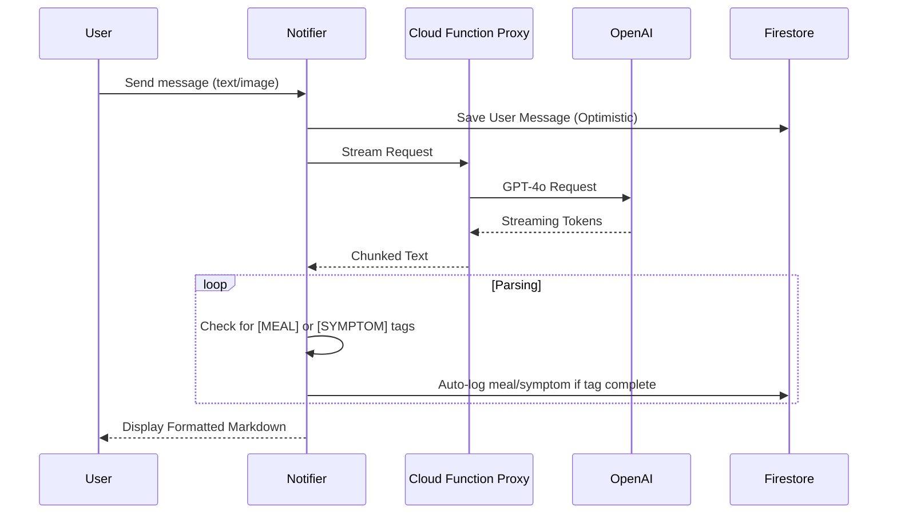
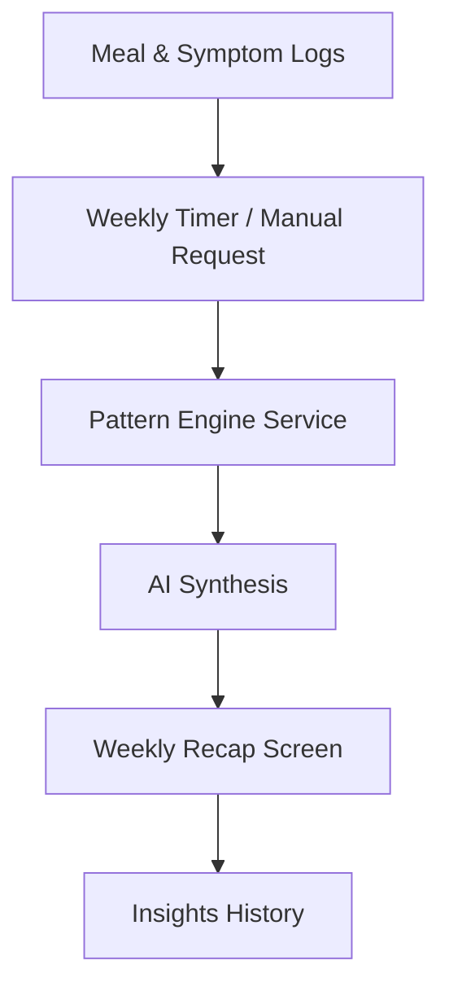

# Application Flow

This document outlines the primary user journeys and logical flows within the GutGood application.

## 1. App Launch & Initialization
The app starts with an authentication check and initialization of core services (Crashlytics, Versioning, Device Info).

---

## 2. Onboarding Flow
Personalization happens during onboarding. Users select goals, sensitivities, and lifestyle factors.

---

## 3. Authentication & Account Migration
Users can start anonymously and later link their data to a permanent account (Google, Apple, or Email).

---

## 4. Food Scanner Flow
The "Super Scanner" handles multiple input types and resolves them to a unified `ScanResult`.

---

## 5. AI Chat & Message Tagging
The chat interface streams AI responses and automatically extracts actionable data.

---

## 6. Insights & Recaps
The app periodically generates insights based on the user's logs.

