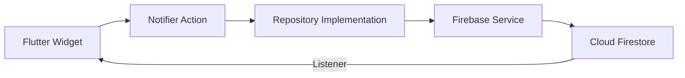
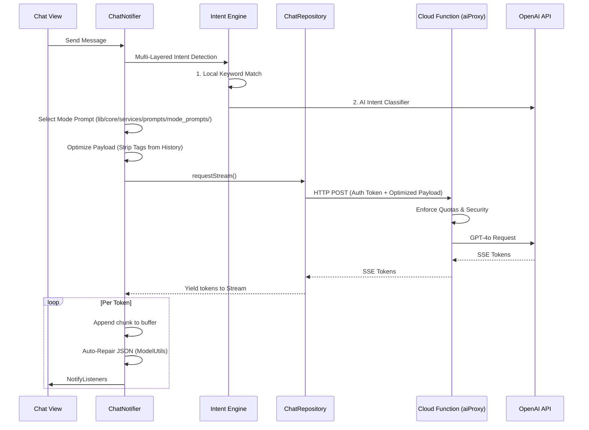
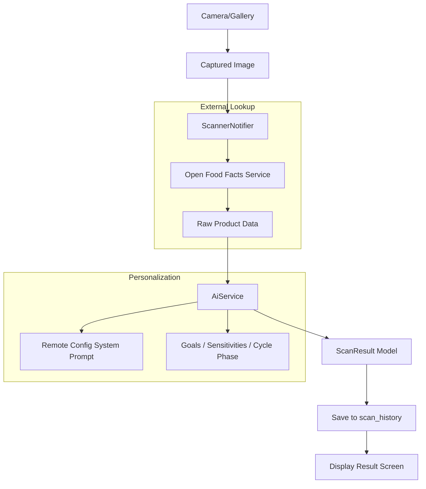
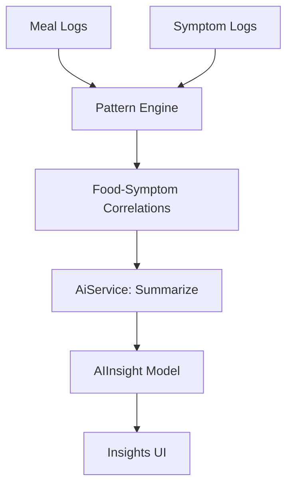
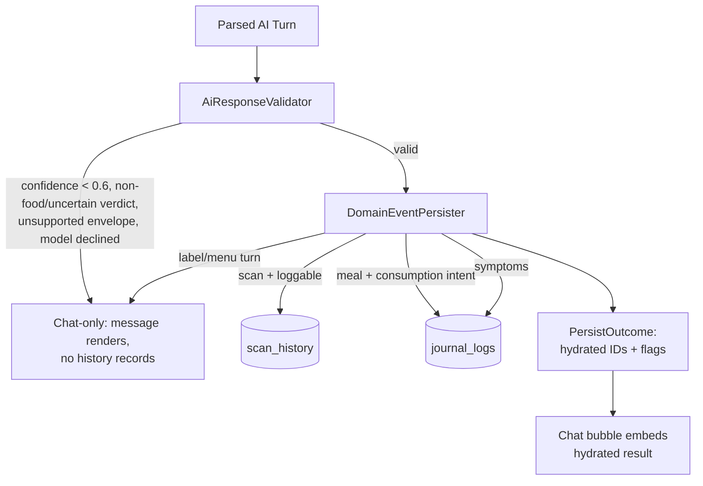

# Data Flow Architecture

This document describes how data moves through the GutGood application, from user interaction to cloud persistence and AI analysis.

## 1. Core Data Path (Unidirectional Flow)
GutGood follows a predictable flow for data mutations:

---

## 2. AI Chat Streaming & Intent Flow
The tokens move from OpenAI through a secure proxy, with dynamic persona switching.

---

## 3. Food Scanning Data Flow
Resolving a physical product to a personalized health insight.

---

## 4. Insight Generation Flow
Correlating logs into actionable patterns.

---

## 5. Offline & Synchronization
- **Write Path:** All Firestore writes (`set`, `update`, `delete`) are handled by the Firestore SDK, which queues them locally if the device is offline.
- **Read Path:** Snapshots are served from the local cache first, then merged with server updates.
- **Optimistic UI:** Feature Notifiers (like `ChatNotifier`) maintain a `Set<String> optimisticIds` to keep locally-created messages visible while Firestore background sync completes.

---

## 6. AI Turn Persistence Pipeline (Phase 2)

Both the chat path (`PersistAiResponseUseCase`) and the scanner path
(`ScannerRepositoryImpl.saveScanResult`) persist records through one shared
router, so their policies can no longer diverge:

- **Chat-only is a first-class outcome**, not an error: low-confidence,
  non-food, and label/menu turns render in chat but write no records.
- **Consumption gate:** a meal block is logged as EATEN only when the turn
  intent describes consumption (`MEAL_RATING`, `MEAL_RECOGNITION`,
  `COMPLETE_ANALYSIS`, legacy empty intent). Questions *about* food
  ("is this healthy?") show the meal in chat without creating a log.
- **Clock split:** writes stamp `createdAt` = log time (ordering clock);
  AI `time` estimates land in `occurredAt` + `occurredAtProvenance`.
  Readers display/correlate on `eventTime` (occurredAt ?? createdAt).
- **Prompt contract:** the model is asked for `"v": 1` and
  `"verdict": "food|non_food|uncertain"` on every `[GUTGOOD_DATA]` block
  (see `schema_definitions.dart`); missing fields are tolerated for
  backward compatibility.
