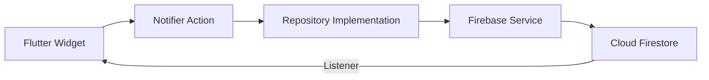
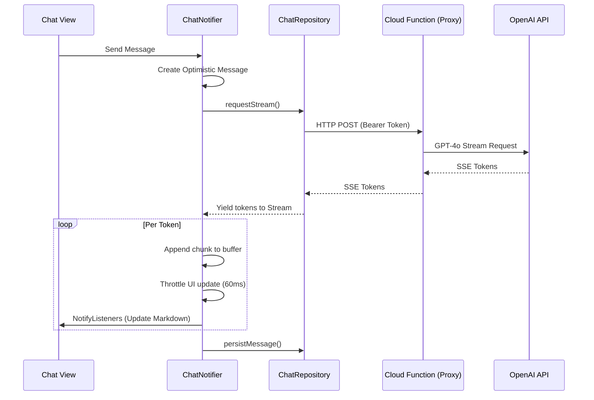
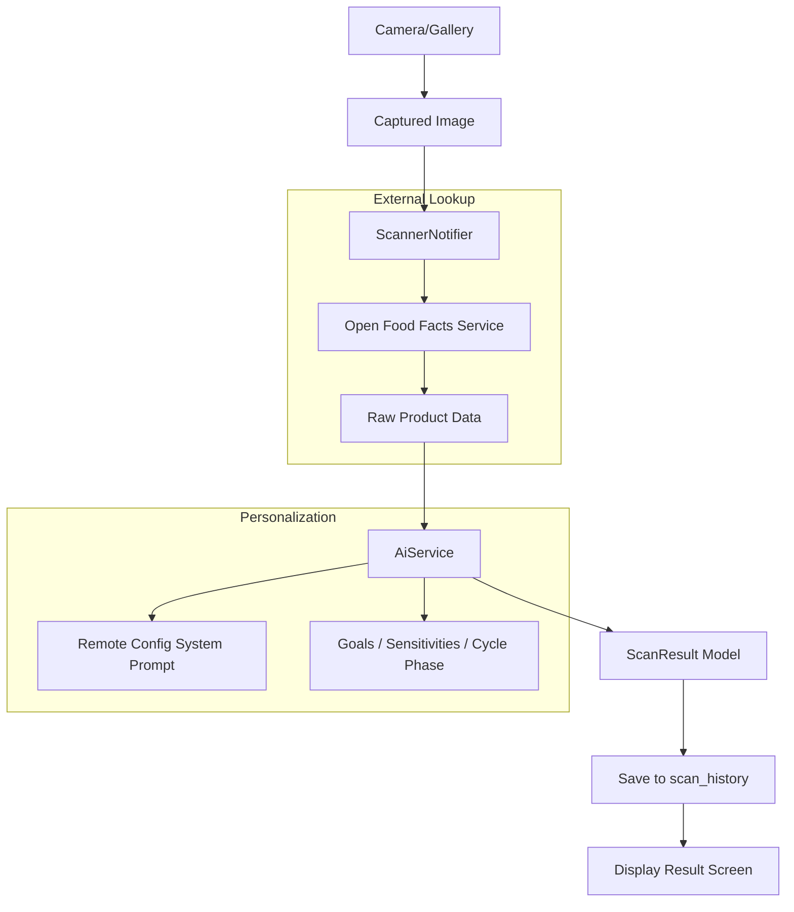
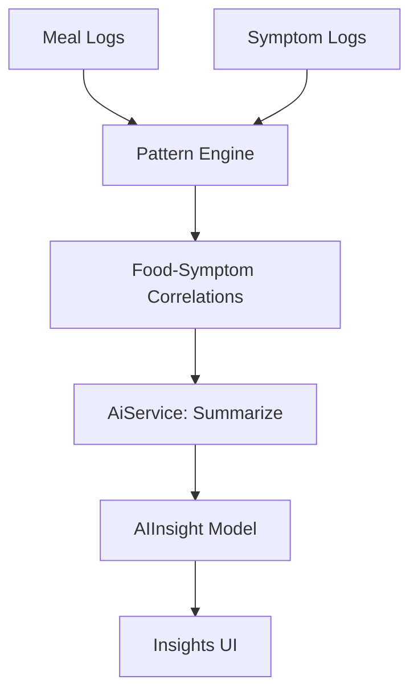

# Data Flow Architecture

This document describes how data moves through the GutGood application, from user interaction to cloud persistence and AI analysis.

## 1. Core Data Path (Unidirectional Flow)
GutGood follows a predictable flow for data mutations:

---

## 2. AI Chat Streaming Flow
The most complex data flow in the app is the token-by-token streaming of AI responses.

---

## 3. Food Scanning Data Flow
Resolving a physical product to a personalized health insight.

---

## 4. Insight Generation Flow
Correlating logs into actionable patterns.

---

## 5. Offline & Synchronization
- **Write Path:** All Firestore writes (`set`, `update`, `delete`) are handled by the Firestore SDK, which queues them locally if the device is offline.
- **Read Path:** Snapshots are served from the local cache first, then merged with server updates.
- **Optimistic UI:** Feature Notifiers (like `ChatNotifier`) maintain a `Set<String> optimisticIds` to keep locally-created messages visible while Firestore background sync completes.
